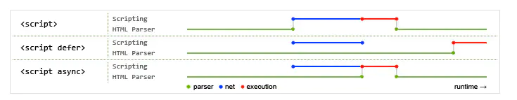

-   script 中 async：可选。表示应该立即开始下载脚本，但不能阻止其他页面动作，比如下载资源或等待其他脚本加载。只对外部脚本文件有效。
-   async：可选。表示应该立即开始下载脚本，但不能阻止其他页面动作，比如下载资源或等待其他脚本加载。只对外部脚本文件有效。
-   在 script 元素上设置 defer 属性，相当于告诉浏览器立即下载，但延迟执行。
-   不过在实际当中，推迟执行的脚本不一定总会按顺序执行或者在 DOMContentLoaded 事件之前执行，因此最好只包含一个这样的脚本。

## 总结

-   defer

```js
<!DOCTYPE html>
<html lang="en">
	<head>
		<meta charset="UTF-8" />
		<meta http-equiv="X-UA-Compatible" content="IE=edge" />
		<meta name="viewport" content="width=device-width, initial-scale=1.0" />
		<title>Document</title>
	</head>
	<body>
		<script>
			console.log(0);
		</script>
		<script src="./1.js"></script>
		<script src="./2.js" defer="defer"></script>
		<script src="./3.js"></script>
		<script src="./4.js" defer="defer"></script>
		<script src="./5.js"></script>
	</body>
</html>

 打印结果 ：013524

```

-   async

```js
<!DOCTYPE html>
<html lang="en">
	<head>
		<meta charset="UTF-8" />
		<meta http-equiv="X-UA-Compatible" content="IE=edge" />
		<meta name="viewport" content="width=device-width, initial-scale=1.0" />
		<title>Document</title>
	</head>
	<body>
		<script>
			console.log(0);
		</script>
		<script src="./1.js"></script>
		<script src="./2.js" async="async"></script>
		<script src="./3.js"></script>
		<script src="./4.js" async="async"></script>
		<script src="./5.js"></script>
	</body>
</html>

打印结果：可能 013524   013542

```


